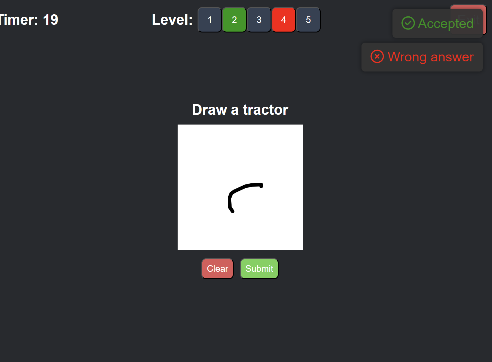
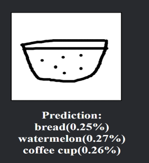

# Drawing Battle - Online Drawing Multiplayer Game  

## Rules
The game will use the rule identical to ICPC format:
- 5 drawing will be given for each players.
- Each wrong submission will penalized for 5 seconds.
- The player who has the most number of correct drawings will be winner. In case there are multiple players have such the same amount of correct drawings, penalty will be used to declare the final winner.

## Features of the game:

- Skill issue

- No Pay-2-Win

- Modern graphics (probably) + Smooth experience

## Mechanism

When a player submits their drawing, top 3 prediction will be used to judge. If one of them matches the corresponding label, the drawing will be accepted.
